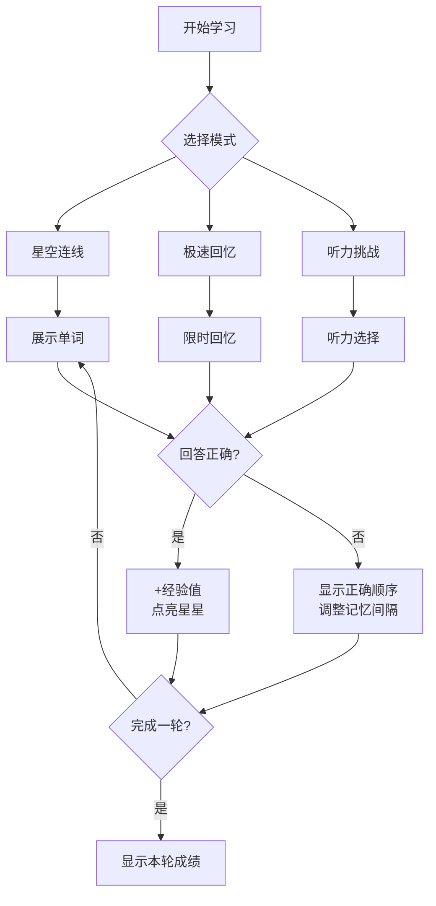
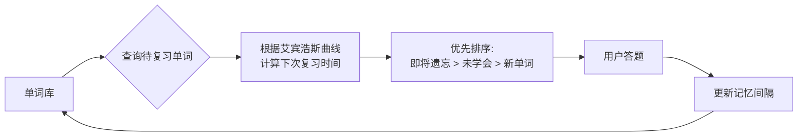

# 记忆星空 - 背单词游戏产品需求文档

## 1. 产品概述

**记忆星空**是一款融合科学记忆规律与游戏化体验的背单词应用。玩家在星空下通过星座连线的玩法记忆单词，将艾宾浩斯遗忘曲线与间隔重复算法融入游戏机制，让背单词变得高效且有趣。

- **核心目的**: 让用户轻松记住单词，显著提升记忆效率
- **目标用户**: 学生、语言学习者、需要进行词汇积累的人群
- **产品价值**: 游戏化学习体验 + 科学记忆算法 = 高效且持久的记忆效果

---

## 2. 核心功能

### 2.1 记忆算法设计

采用**改良版间隔重复算法 (SM-2 + 艾宾浩斯曲线)**:

| 熟练度等级 | 复习间隔 | 适用场景 |
|-----------|---------|---------|
| 1 - 完全陌生 | 立即 | 初次学习 |
| 2 - 有点印象 | 1分钟 | 第一次回忆失败 |
| 3 - 轻微熟悉 | 10分钟 | 短暂记忆 |
| 4 - 较为熟悉 | 1天 | 基本掌握 |
| 5 - 熟练掌握 | 3天 | 巩固记忆 |
| 6 - 完全记住 | 7天 | 长期记忆 |

**关键机制**:
- 每次答题根据表现调整单词的复习间隔
- 连续正确可加速升级，连续错误会降级
- 优先复习即将遗忘的单词（最近一次遗忘曲线附近的单词）

### 2.2 游戏模式

#### 2.2.1 星空连线模式 (主模式)
- 展示单词的字母组合，玩家需要按正确顺序点击字母
- 连线正确时触发星星连线动画
- 连续答对可点亮星座，获得更高分数

#### 2.2.2 极速回忆模式
- 限时10秒看单词回忆中文释义
- 考验瞬时记忆能力
- 适合复习已学过的单词

#### 2.2.3 听力挑战模式
- 播放单词发音，选择正确中文释义
- 提升听力和发音辨识能力

### 2.3 单词集管理

- **内置词库**: 提供基础英语四六级词汇
- **自定义导入**: 支持手动添加单词（单词 + 释义 + 例句）
- **分组管理**: 按主题或难度分类管理单词集
- **单词本编辑**: 可增删改查每个单词信息

### 2.4 进度追踪

- **学习进度**: 今日学习单词数、正确率
- **记忆曲线**: 可视化展示记忆稳固程度
- **连续打卡**: 激励坚持学习的 streak 系统
- **成就系统**: 解锁各种成就徽章

---

## 3. 核心流程

### 3.1 学习流程



### 3.2 记忆调度流程



---

## 4. 用户界面设计

### 4.1 设计风格

**主题**: 梦幻星空 + 极简主义

- **主色调**: 深蓝色渐变背景 (#0a0a1a → #1a1a3a)
- **强调色**: 金色 (#ffd700) 用于星星和高亮
- **次要色**: 紫色 (#9b59b6) 用于辅助元素
- **文字色**: 白色 (#ffffff) 和 浅灰色 (#b0b0b0)

**字体**:
- 标题: "ZCOOL KuaiLe" (有趣的中文字体) 或 "Quicksand"
- 英文单词: "Poppins" (现代无衬线)
- 中文释义: "Noto Sans SC"

**布局**: 卡片式设计，中央聚焦的交互区域

### 4.2 页面结构

| 页面 | 模块 | 描述 |
|-----|-----|-----|
| 首页 | 星空背景 + 今日状态卡片 | 显示学习进度、连续天数、待复习单词数 |
| 学习页 | 游戏区域 + 字母拼图 | 核心学习交互界面 |
| 词库页 | 单词列表 + 筛选器 | 管理和浏览单词集 |
| 统计页 | 记忆曲线 + 成就墙 | 查看学习数据和成就 |
| 设置页 | 主题/音效/词库选择 | 个性化配置 |

### 4.3 动画设计

- **星星闪烁**: 背景星星随机闪烁动画
- **连线动画**: 正确答题时星星之间连线发光
- **卡片翻转**: 显示答案时的3D翻转效果
- **得分弹出**: 数字增长和金币飞入动画
- **页面转场**: 滑动渐变过渡

---

## 5. 数据模型

### 5.1 核心数据结构

```
单词 (Word):
  - id: string
  - word: string (英文单词)
  - meaning: string (中文释义)
  - sentence: string (例句，可选)
  - phonetic: string (音标，可选)

学习记录 (LearningRecord):
  - wordId: string
  -熟练度等级: number (1-6)
  - 下次复习时间: timestamp
  - 正确次数: number
  - 错误次数: number

用户进度 (UserProgress):
  - 总学习单词数: number
  - 当前连续天数: number
  - 总获得经验值: number
  - 解锁成就列表: string[]

单词集 (WordSet):
  - id: string
  - name: string
  - 单词列表: Word[]
  - 创建时间: timestamp
```

---

## 6. 技术实现优先级

### MVP版本 (Demo)
1. 星空连线模式（核心玩法）
2. 内置基础词库（50-100个单词）
3. 简单的进度追踪
4. 基础的间隔重复算法

### 后续迭代
- 极速回忆模式和听力模式
- 自定义单词导入
- 成就系统
- 多语言支持
