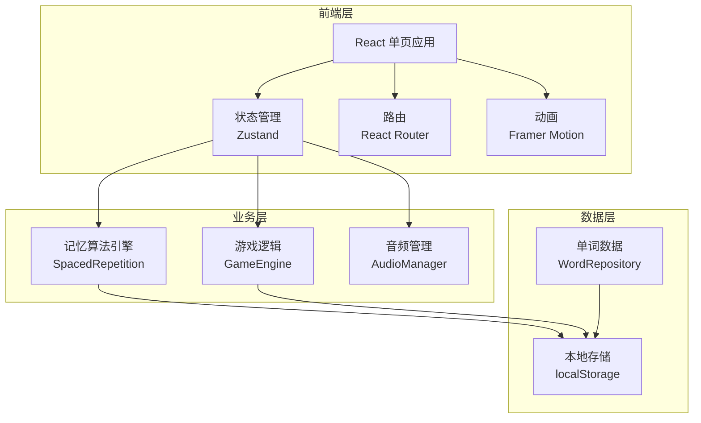

# 记忆星空 - 技术架构文档

## 1. 架构设计



**技术栈**:
- 前端框架: React 18 + Vite
- 样式方案: Tailwind CSS + 自定义CSS动画
- 状态管理: Zustand
- 动画库: Framer Motion
- 路由: React Router DOM v6
- 数据持久化: localStorage
- 音频: Web Audio API

## 2. 核心模块

### 2.1 记忆算法引擎 (SpacedRepetition.ts)

```typescript
interface WordRecord {
  wordId: string;
 熟练度: number; // 1-6
  下次复习时间: number; // timestamp
  正确次数: number;
  错误次数: number;
}

// 间隔配置（毫秒）
const INTERVALS = {
  1: 0,           // 立即
  2: 60 * 1000,   // 1分钟
  3: 10 * 60 * 1000, // 10分钟
  4: 24 * 60 * 60 * 1000, // 1天
  5: 3 * 24 * 60 * 60 * 1000, // 3天
  6: 7 * 24 * 60 * 60 * 1000, // 7天
};
```

### 2.2 游戏引擎 (GameEngine.ts)

**状态机**:
```
IDLE → SHOW_WORD → USER_INPUT → CHECK_ANSWER → RESULT → IDLE
```

**关键函数**:
- `generateLetterPuzzle(word: string)`: 打乱字母生成拼图
- `checkAnswer(selected: string[], correct: string[])`: 验证答案
- `calculateScore(correct: boolean, time: number)`: 计算得分

### 2.3 星星渲染系统 (StarField.tsx)

- Canvas 渲染星空背景
- 随机生成星星位置和亮度
- 点击星星触发连线动画

## 3. 路由定义

| 路由 | 页面 | 描述 |
|-----|-----|-----|
| `/` | 首页 | 概览、开始学习按钮 |
| `/learn` | 学习页 | 星空连线游戏 |
| `/library` | 词库页 | 管理单词集 |
| `/stats` | 统计页 | 学习数据统计 |
| `/settings` | 设置页 | 应用设置 |

## 4. 数据模型

### 4.1 数据结构

```typescript
// 单词
interface Word {
  id: string;
  word: string;
  meaning: string;
  sentence?: string;
  phonetic?: string;
}

// 学习记录
interface LearningRecord {
  [wordId: string]: {
    熟练度: number;
    下次复习时间: number;
    正确次数: number;
    错误次数: number;
    lastReviewTime: number;
  };
}

// 用户进度
interface UserProgress {
  totalWordsLearned: number;
  currentStreak: number;
  totalXP: number;
  achievements: string[];
  lastStudyDate: string;
}
```

### 4.2 localStorage 键名

| 键名 | 数据类型 | 描述 |
|-----|---------|-----|
| `memory_star_words` | Word[] | 单词数据 |
| `memory_star_records` | LearningRecord | 学习记录 |
| `memory_star_progress` | UserProgress | 用户进度 |
| `memory_star_settings` | Settings | 设置 |

## 5. 组件结构

```
src/
├── components/
│   ├── StarField/         # 星空背景
│   ├── LetterPuzzle/      # 字母拼图组件
│   ├── WordCard/          # 单词卡片
│   ├── ProgressBar/       # 进度条
│   ├── ScorePopup/        # 得分弹出
│   └── Navigation/        # 导航栏
├── pages/
│   ├── Home.tsx           # 首页
│   ├── Learn.tsx          # 学习页
│   ├── Library.tsx        # 词库页
│   ├── Stats.tsx          # 统计页
│   └── Settings.tsx       # 设置页
├── hooks/
│   ├── useSpacedRepetition.ts  # 间隔重复逻辑
│   ├── useGame.ts         # 游戏状态管理
│   └── useLocalStorage.ts # 本地存储
├── stores/
│   ├── gameStore.ts       # 游戏状态
│   └── userStore.ts       # 用户数据
├── utils/
│   ├── spacedRepetition.ts # 算法实现
│   └── wordGenerator.ts   # 单词生成器
└── data/
    └── defaultWords.ts    # 默认词库
```

## 6. 内置词库 (MVP版本)

提供约50个基础英语单词，涵盖日常高频词汇:

```
apple, book, cat, dog, egg, flower, garden, house, ice, juice,
kitchen, lamp, moon, night, orange, pencil, queen, river, sun,
table, umbrella, violin, water, xylophone, yellow, zebra,
balloon, candy, door, elephant, frog, glasses, horse, igloo,
jacket, kite, lemon, mirror, nest, octopus, pizza, rainbow,
star, tiger, unicorn, vase, window, rabbit, snow, cloud
```

---

## 7. 性能优化

- 星空背景使用 Canvas 而非 DOM 元素
- 动画使用 CSS transform 和 opacity（GPU加速）
- 单词数据懒加载
- 游戏状态批量更新
